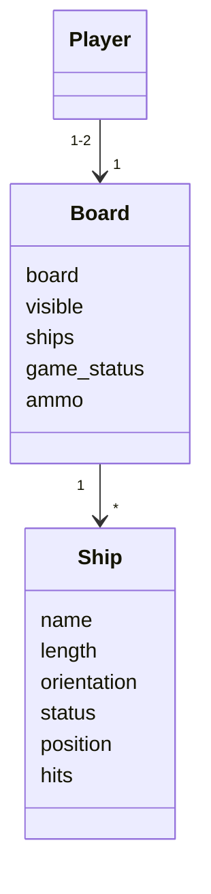

# Arkkitehtuurikuvaus
----
## Rakenne

Sovelluksen rakenne koostuu luokista main, ship ja board. Lisäksi sovelluksessa on 3 käyttöliittymäluokkaa menu, single ja pvc  sekä 13 sprites-luokkaa. Luokat on jaettu kansioihin ui, objects ja sprites. Kansiossa src sijaitsee sovelluslogiikka, kansiossa ui käyttöliittymät, objects kansiossa luokat ship ja board ja kansiossa sprites sprite-luokat. Kansiossa assets sijaitsevat ui tarvitsemat kuvatiedostot sekä image-luokka.

----
## Käyttöliittymä

Käyttöliittymäluokat ovat menu, single ja pvc. Menu luokkaa sisältää aloitusvalikon, josta voi valita haluttu peli tai lopettaa sovelluksen käyttämistä.

----
## Sovelluslogiikka

Player luokka ei ole vielä toteutettu. Tämän vuoksi rakenne on vajavaista.

----
## Päätoiminnallisuudet

### Laivojen alustus

### Menu silmukan luonnos. Tämä luonnos ei vielä vastaa kokonaistilannetta.

### Yksinpelin silmukka
