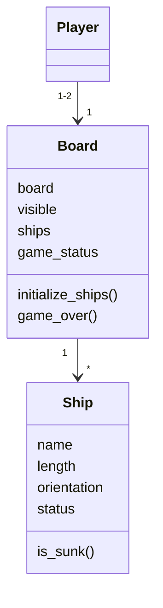

# Arkkitehtuurikuvaus
----
## Rakenne

Tässä vaiheessa sovelluksen rakenne koostuu luokista main, ship ja board. Lisäksi sovelluksessa on 2 käyttöliittymäluokkaa sekä 13 sprites luokkaa.

----
## Käyttöliittymä

Käyttöliittymäluokat ovat menu ja single. Menu luokkaa sisältää aloitusvalikon, josta voi valita haluttu peli tai lopettaa sovelluksen käyttämistä. 

----
## Sovelluslogiikka

Player luokka ei ole vielä toteutettu. Tämän vuoksi rakenne on vajavaista.

----
## Päätoiminnallisuudet

Sequence-kaavio on tämän hetken tilannetta kuvaava kaavio. 

### Laivojen alustus

