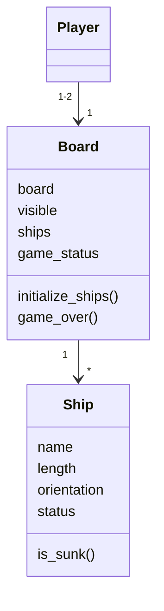

# Arkkitehtuurikuvaus
----
## Rakenne

Tätä osuutta ei vielä tehty

----
## Käyttöliittymä

Käyttöliittymä ei vielä toteutettu

----
## Sovelluslogiikka

Player luokka ei ole vielä toteutettu. Myös Game luokka ei ole vielä toteutettu. Tämän vuoksi rakenne on vajavaista.

----
## Päätoiminnallisuudet

Sequence-kaavio on pahasti kesken, koska osa luokista ei vielä toteutettu.

### Laivojen alustus

