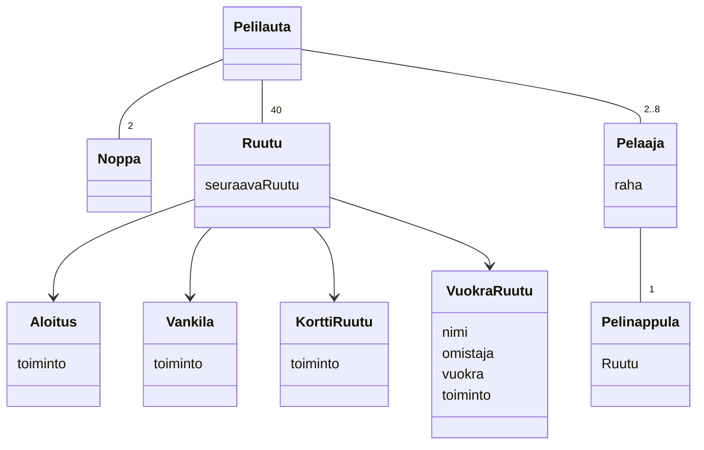

```mermaid
 classDiagram
      Pelilauta -- "2" Noppa
      Pelilauta -- "40" Ruutu
      Pelilauta -- "2..8" Pelaaja
      Pelaaja -- "1" Pelinappula
      Ruutu --> Aloitus
      Ruutu --> Vankila
      Ruutu --> KorttiRuutu
      Ruutu --> VuokraRuutu
      class Aloitus{
          toiminto
      }
      class Vankila{
          toiminto
      }
      class KorttiRuutu{
          toiminto
      }
      class VuokraRuutu{
          nimi
          omistaja
          vuokra
          toiminto
      }
      class Pelilauta{
      }
      class Pelaaja{
          raha
      }
      class Noppa{
      }
      class Ruutu{
          seuraavaRuutu
      }
      class Pelinappula{
          Ruutu
      }
```
